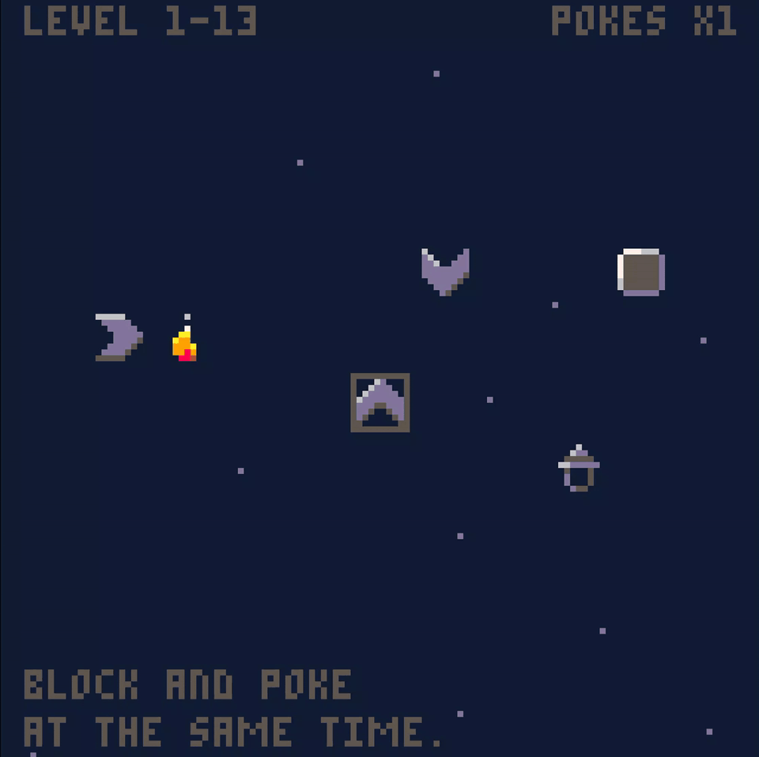

# Run

- Go to https://www.pico-8-edu.com/
- Start the Pico-8 and drop `the-lowly-lamplighter.p8` onto it to load the cartridge.
- Ctrl-R to run the game.

# Cover


# Gameplay



# Export

## Zip

```
export -f the-lowly-lamplighter.html -p plate
```

## PICO-8 Cartridge

```
export the-lowly-lamplighter.p8.png
```
